# PRATIKUM 3: PHP dan Database MySQL

**Nama : Nurul Najwa Sabilla**  
**Kelas : TI.21.A.3**  
**Nim : 312110451**  

## 1. Menjalankan MySQL Server
Untuk menjalankan MySQL Server dan menu XAMPP Control

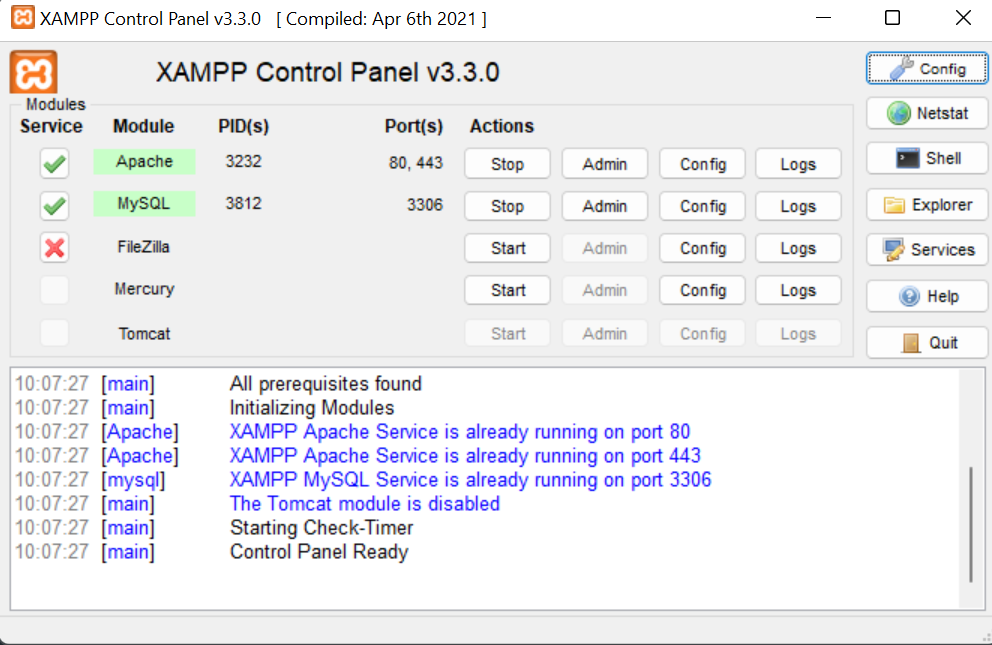

## 2. Membuat Database 
CREATE DATABASE latihan1; 
Membuat database dengan latihan1 di PHPMyAdmin

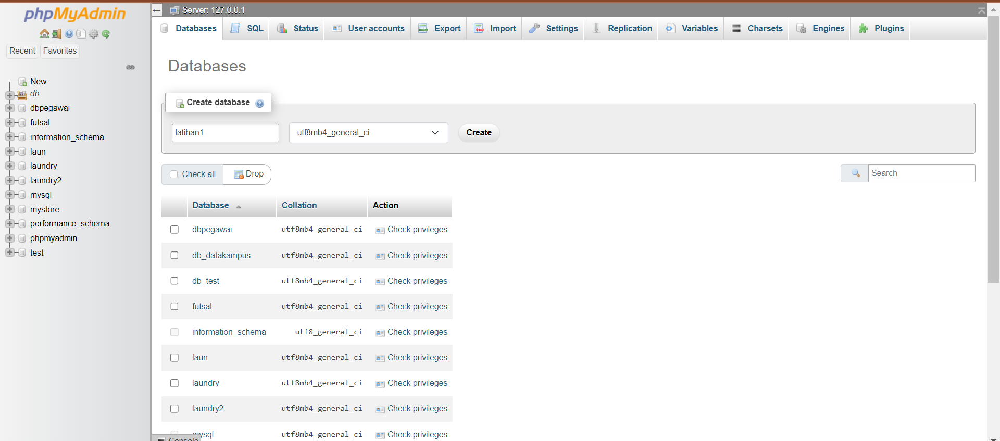

## 3. Membuat Tabel
Membuat tabel di database dengan nama data_barang

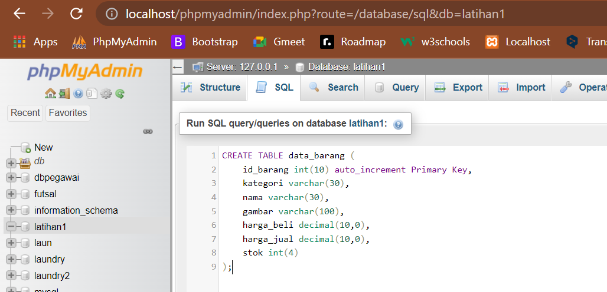

## 4. Menambahkan Data
Pada modul Lab3Web data awal terisi seperti berikut ini :

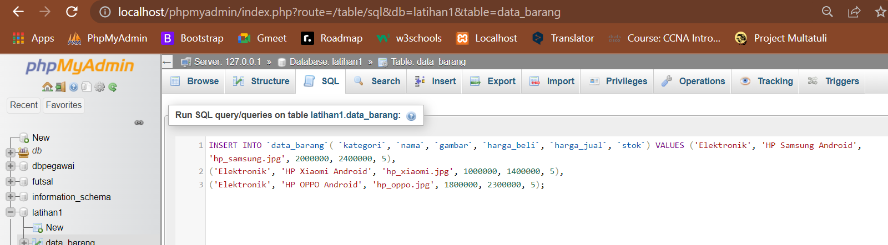

Melihat isi tabel pada shell XAMPP 

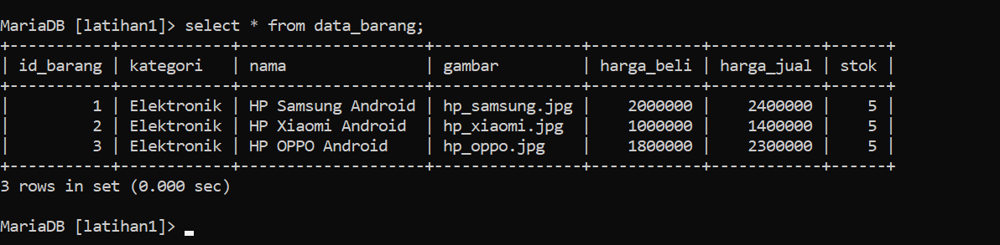

Ini merupakan database baru yang saya buat, jika dilihat dari shell maka seperti ini :

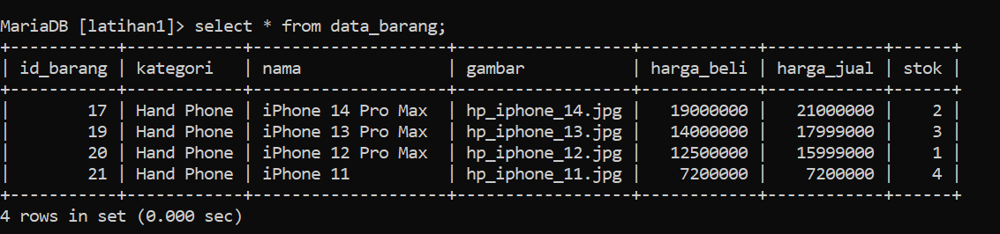

## 5. Membuat Program CRUD
Seperti biasa membuat folder pada htdocs dengan nama folder lab3_php_database.
Setelah itu, mengakses directory tersebut pada web server dengan mengakses url http://localhost/lab3_php_database

## 6. Membuat File Koneksi Database
Buat file baru dengan nama koneksi.php

Dengan source code :

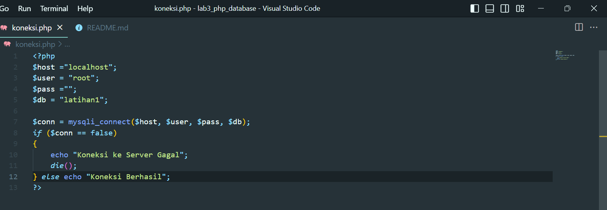

Dengan output :

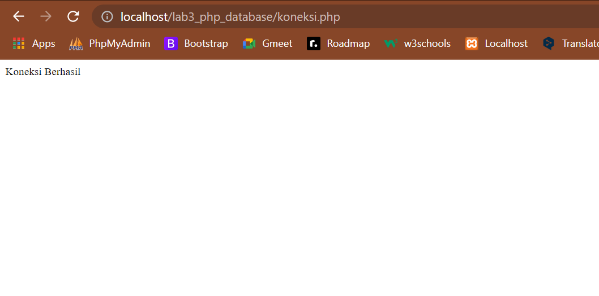

Jika, sudah output sudah terlihat. Untuk line ke-12 untuk -> else echo "Koneksi berhasil"; saja

## 7. Membuat File Index Untuk Menampilan Data (Read)
Buat file baru dengan nama index.php

Dengan source code :

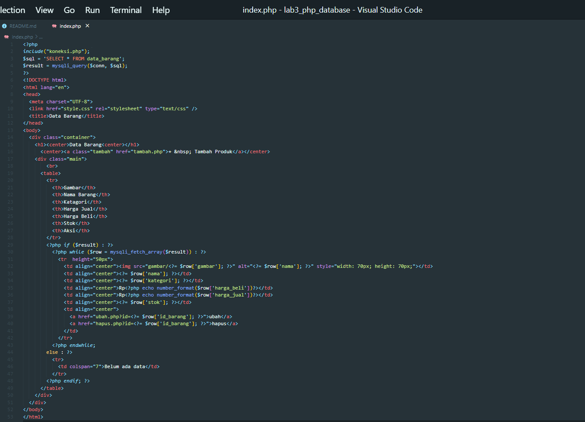

Dengan output : 

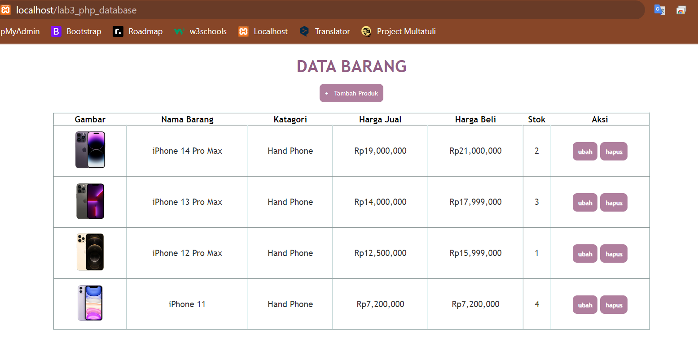

Pemberi styling untuk index.php seperti ini :
Buat file baru dengan nama style.css

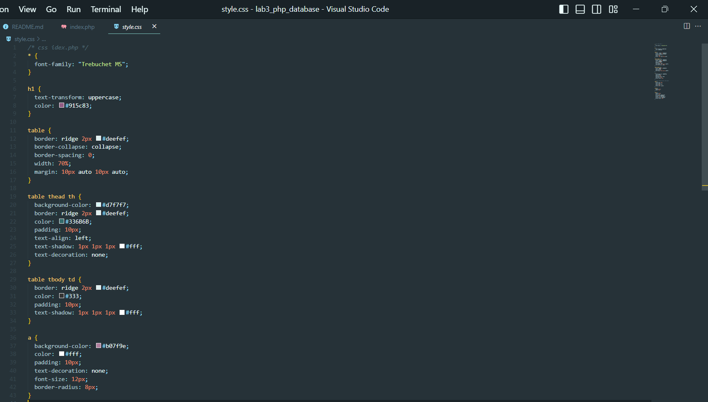

## 8. Menambahkan Data (Create)
Buat file baru dengan nama tambah.php

Dengan source code :

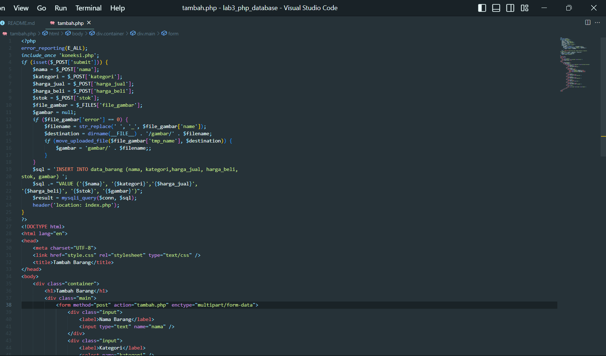

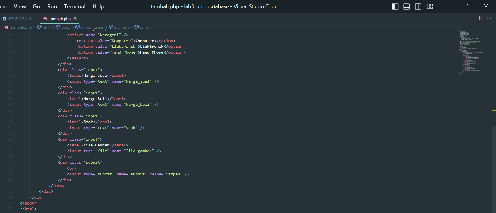

Dengan output :

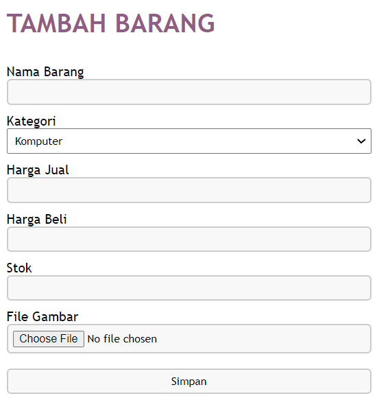

## 9. Mengubah Data (Update)
Buat file baru dengan nama ubah.php

Dengan source code :

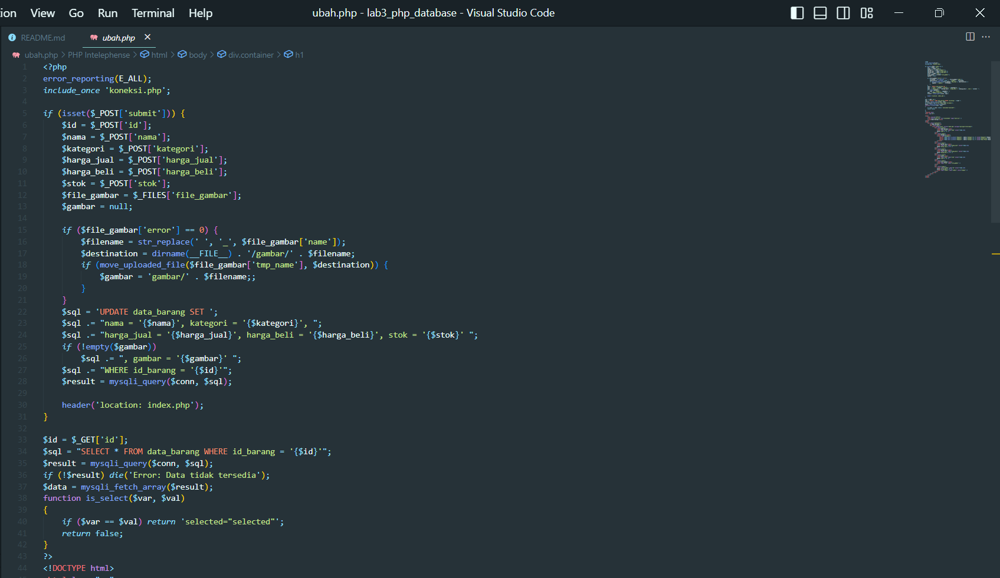

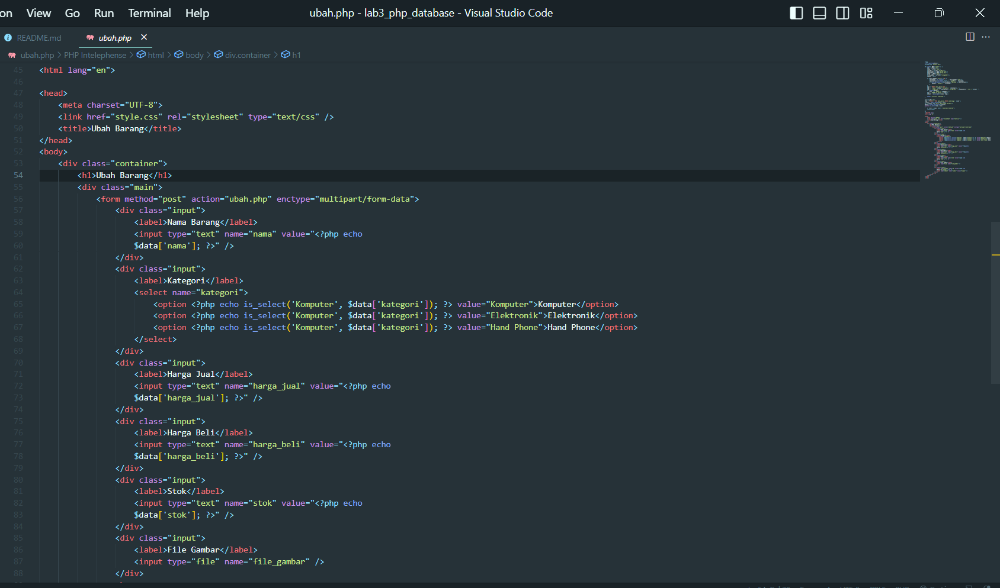

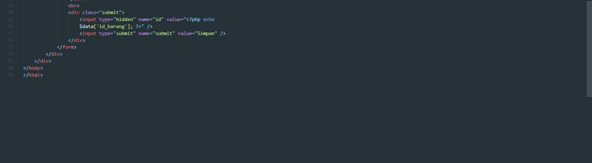

Dengan output :

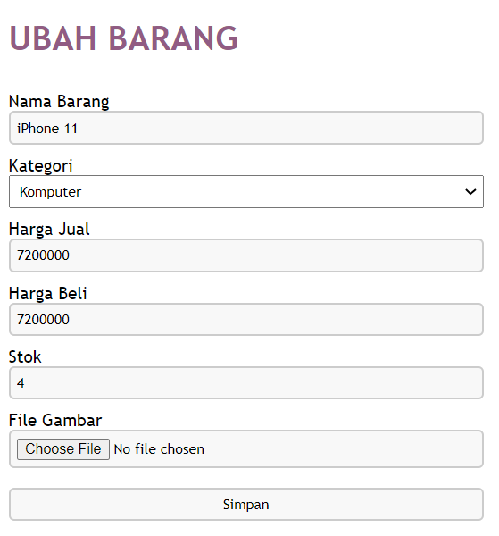

Untuk styling tambah.php dan ubah.php seperti ini 

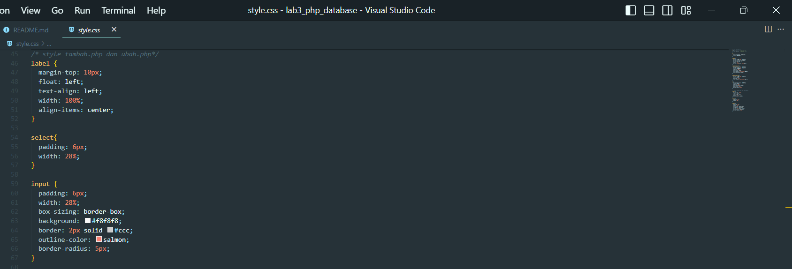

## 10. Menghapus Data (Delete)
Buat file baru dengan nama hapus.php

Dengan source code :

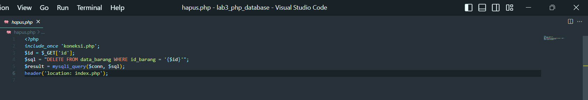

